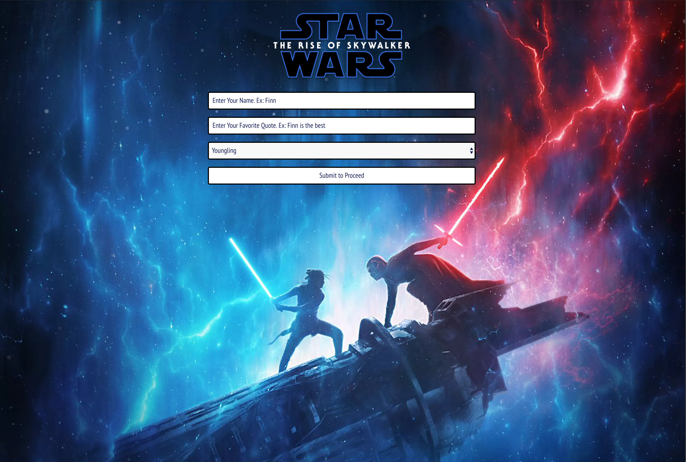
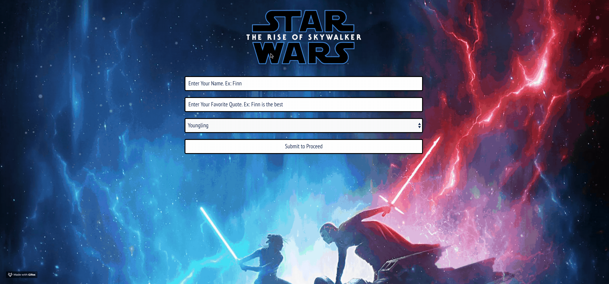
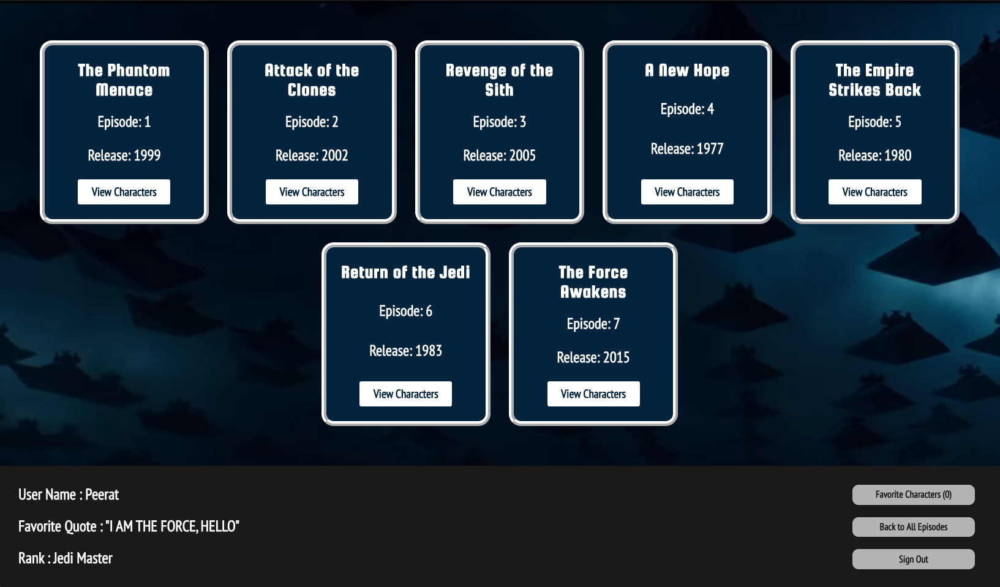
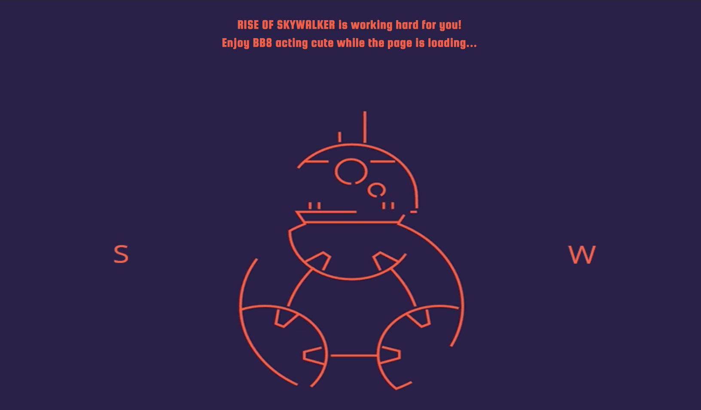
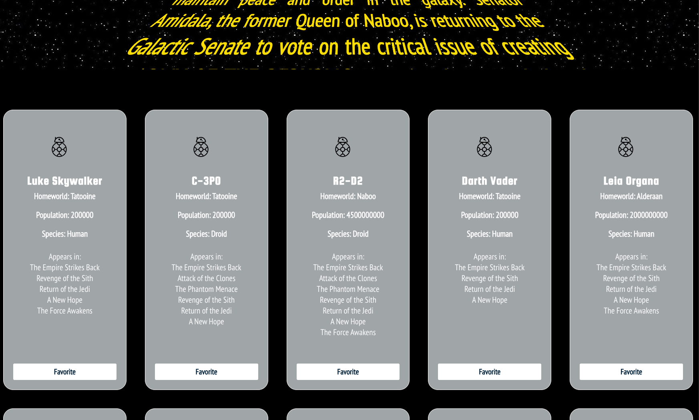

# The Rise Of Skywalker

## Contributors : Peerat Sukcharoenyingyong & Naomi Campos

### Overview
This was a one-week, paired project built using React. We utilized the Fetch API to access several nested endpoints and display chosen data on the DOM. We used React Router to redirect the user to different character list pages for whichever Star Wars epsiode they chose. On the character page, the user can also "favorite" the characters they like best, and can choose to display only those characters. The user also has the ability to sign out which will redirect them to the landing page.

### Working Product GIFS

### Learning Goals
- Write squeaky clean, well refactored code using ES6 syntax.
- Make informed design decisions to create a user-friendly application.
- Keep state based components to a minimum and leverage more functional components.
- Use a modular architecture for your application file structure.
- Think deeply about React Lifecycle Methods.
- Become familiar with promises, nested fetch requests, and handling the UI based on acceptance of data.
- Become familiar with routing and how to handle dynamic routes.
- Use propTypes for every component receiving props.
- Write tests for React components and some asynchronous functionality.

### Technologies Used 
- React
- React Router
- JSX
- Jest
- Enzyme
- Fetch API

### Setup 
1. Clone down the repo
2. cd into repo
3. npm install 
4. npm start
5. http://localhost:3000

### Screenshots

